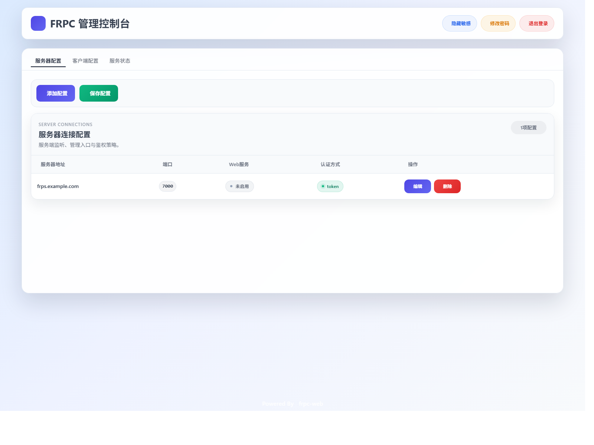
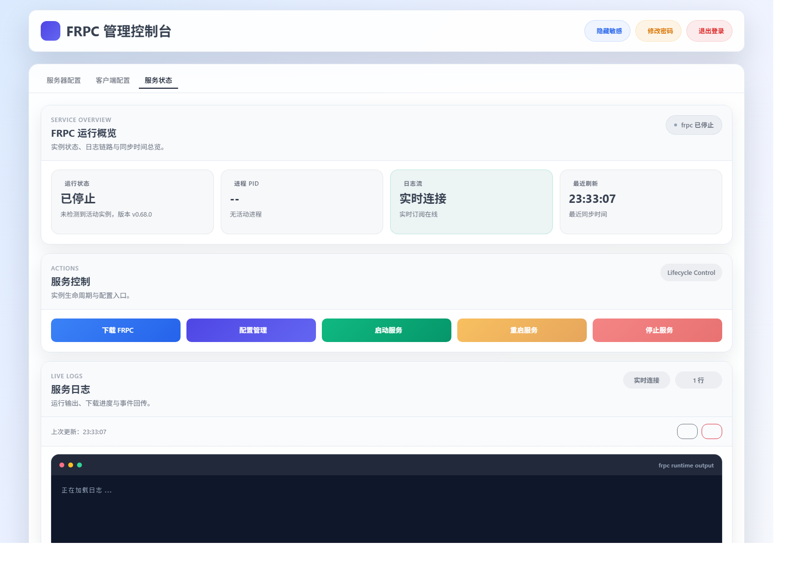

# frpc-web

一个基于 Flask 的 FRPC Web 管理面板，用来完成 `frpc` 配置维护、服务启停、运行状态查看、日志追踪和一键下载。

## 页面预览

### 控制台首页



### 服务状态页



## 功能概览

- 登录认证与首次登录改密
- 在线维护 `config.json` / `frpc.json`
- 支持下载 `linux_amd64` 版本 `frpc`
- 提供 FRPC 启动、停止、重启和日志查看能力
- 支持运行状态展示、版本信息展示与健康检查
- 支持 Docker Compose 一键部署

## 仓库结构

```text
frpc-web/
├─ app/                    Flask 主应用
│  ├─ auth/                登录与密码修改
│  ├─ main/                页面路由与接口
│  ├─ static/login/        登录页静态资源（发布内容）
│  ├─ templates/           Flask 模板
│  └─ utils/               frpc 管理、网络检查、校验工具
├─ docs/images/            README 使用的截图资源
├─ migrations/             Alembic 数据库迁移
├─ tests/                  自动化测试
├─ .env.example            公开示例环境变量
├─ config.json             公开示例配置
├─ docker-compose.yml      推荐部署方式
└─ run.py                  启动入口
```

## 快速开始

### 1. 获取代码

```bash
git clone https://github.com/xirankj/frpc-web.git
cd frpc-web
```

### 2. 准备环境变量

```bash
cp .env.example .env
```

最少需要关注这些配置：

```ini
WEB_PORT=8001
DEFAULT_USERNAME=admin
DEFAULT_PASSWORD=ChangeMe_123!
SECRET_KEY=replace-with-a-random-secret
DATABASE_URL=sqlite:////app/data/frpc.db
LOG_LEVEL=INFO
LOG_FILE=/var/log/frpc-web/app.log
FRPC_LOG_DIR=/var/log/frpc-web
TZ=Asia/Shanghai
```

如果你希望在“服务状态”里读取远端 `frps` 版本，可以额外配置：

```ini
FRPS_VERSION_URL=
FRPS_VERSION_USERNAME=
FRPS_VERSION_PASSWORD=
```

### 3. 使用 Docker Compose 启动

```bash
docker compose up -d
```

首次启动会自动：

- 执行数据库迁移
- 创建默认管理员账号
- 初始化数据目录与日志目录
- 在检测到 `frpc` 与 `frpc.json` 时尝试自动拉起 FRPC

### 4. 访问系统

默认地址：

```text
http://<你的服务器IP>:8001
```

首次登录后系统会要求修改密码。

## 示例配置

仓库根目录的 `config.json` 已替换为公开示例，可直接作为参考模板：

```json
{
  "serverAddr": "frps.example.com",
  "serverPort": 7000,
  "auth": {
    "method": "token",
    "token": "replace-with-your-token"
  },
  "proxies": [
    {
      "enabled": true,
      "name": "frpc-web",
      "type": "tcp",
      "localIP": "127.0.0.1",
      "localPort": 8001,
      "remotePort": 8080
    },
    {
      "enabled": true,
      "name": "demo-site",
      "type": "http",
      "localIP": "127.0.0.1",
      "localPort": 3000,
      "customDomains": [
        "demo.example.com"
      ]
    }
  ]
}
```

## 本地运行

如果你不使用 Docker，也可以直接运行：

```bash
python -m venv .venv
. .venv/bin/activate  # Windows 请改用 .venv\Scripts\activate
pip install -r requirements.txt
python run.py
```

本地运行时，容器内路径会自动映射到项目目录：

- `/app/data` -> `./data`
- `/var/log/frpc-web` -> `./logs`


## 许可证

本项目采用 MIT 许可证，详见 [LICENSE](LICENSE)。
